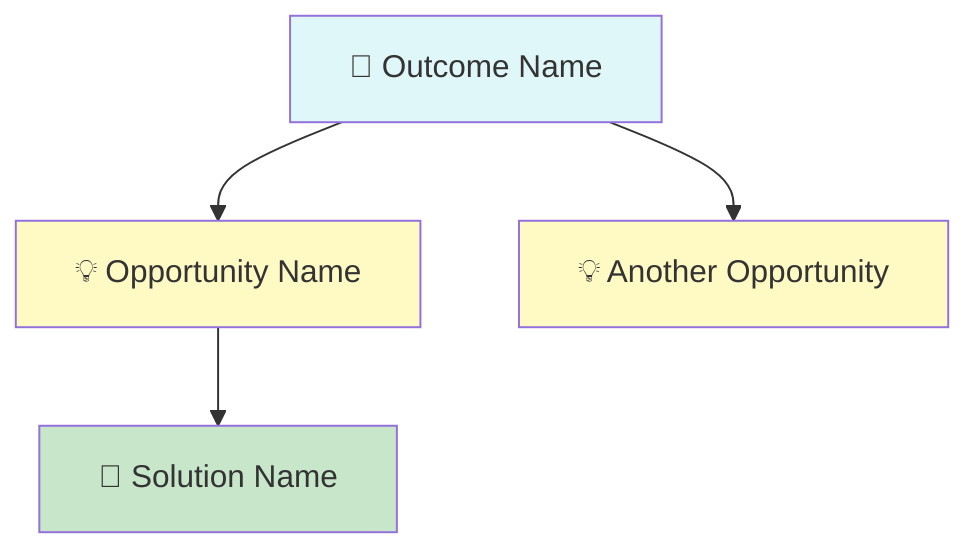

# List Opportunities

Query the configured backend and display the Opportunity Solution Tree as a hierarchical text tree.

## Workflow

1. Resolve backend and initiative: read `## OST Configuration` from the project's CLAUDE.md to determine the backend. Read `skills/setup/markdown-backend.md` or `skills/setup/notion-backend.md` accordingly. Follow the **Initiative Resolution** section to select the target initiative.
2. Retrieve all OST nodes.
3. Build the tree by following parent relationships.
4. Display using the format below.
5. If markdown backend with `obsidian-features: true`: regenerate Canvas and Base files.

## Steps

### 1. Retrieve All Nodes

#### Markdown backend

1. Use the resolved initiative path from Step 1.
2. Glob all `{initiative-path}/OST/**/*.md` files.
3. Read each file's frontmatter: `ost-type`, `status`, `confidence`, `parent`, `evidence-summary`.

#### Notion backend

1. Search for all OST Nodes linked to the resolved Initiative.
2. Fetch each node's details: Name, Type, Status, Confidence, Evidence Summary, Parent relation.

### 2. Build the Tree

- **Markdown**: follow `parent` wikilinks — extract the note name from `[[Note Name]]` and match to filenames.
- **Notion**: follow Parent relation properties.
- Nodes with no parent are root nodes (Outcomes).

### 3. Display

```
## {Initiative Name} — Opportunity Solution Tree

🎯 **Outcome Name** [Status] (Confidence%)
  Evidence: <evidence summary>
  └── 💡 **Opportunity Name** [Status] (Confidence%)
        Evidence: <evidence summary>
        ├── 🔧 **Solution Name** [Status] (Confidence%)
        │     Evidence: <evidence summary>
        │     └── 🧪 **Experiment Name** [Status] (Confidence%)
        │           Evidence: <evidence summary>
        └── 🔧 **Another Solution** [Status] (Confidence%)
              Evidence: <evidence summary>
```

### Display Rules

- Sort alphabetically within each level.
- Show Status and Confidence for every node.
- Show Evidence Summary if present (truncate to ~80 chars).
- No branch indicator below childless nodes.
- If tree is empty, suggest `/ost:capture-feedback` or `/ost:analyze-transcript` to start building it.

### Node type icons

| Type | Icon |
|------|------|
| Outcome | 🎯 |
| Opportunity | 💡 |
| Solution | 🔧 |
| Experiment | 🧪 |
| Assumption | 🤔 |

### 4. Regenerate Visualization (Markdown Backend Only)

Only when `obsidian-features: true` in the OST configuration. Reference `skills/setup/markdown-backend.md` for Canvas and Base file formats.

#### Canvas (`OST.canvas`)

Generate an Obsidian Canvas JSON file at `{initiative-path}/OST/OST.canvas`:

Follow the Canvas Generation section in `markdown-backend.md` for node dimensions, colors, layout, and edge rules.

#### Base (`OST.base`)

Write the Base file at `{initiative-path}/OST/OST.base` using the template in `markdown-backend.md`. This provides tabular filtering and grouping in Obsidian.

### 5. Mermaid Output (Both Backends, Optional)

After displaying the text tree, also output a mermaid code block that can be copied into any note for an inline visual. This is lightweight and renders in Obsidian's reading view.

````

````

Color mapping for mermaid `style` fills:

| Type | Fill color |
|------|-----------|
| Outcome | `#e0f7fa` |
| Opportunity | `#fff9c4` |
| Solution | `#c8e6c9` |
| Experiment | `#e1bee7` |
| Assumption | `#ffe0b2` |

Use short unique IDs (A, B, C...) for mermaid node references. Include the type icon in the label.
